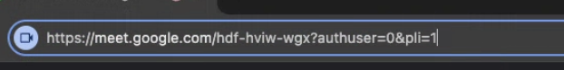

# Actividad4-FS-PaginaWeb

El proyecto multipage nos muestra cómo renderizar distintas páginas usando pathname y `query Params`.

Partes de la imagen:
- El subdominio es meet.
- El dominio es google.com
- A partir de / y todo lo que sigue hasta el símbolo ? es el path.
- A partir del símbolo ?, todo lo que sigue son query Params.

<!--INICIAR EN LA TERMINAL:
npm create vite@latest
# elegimos el nombre del proyecto, carpeta, etc...
# elegimos REACT como librería de trabajo.
cd nombre-proyecto
npm i
npm run dev -->

# IDEA DE LA STARTUP:

Proyecto: Books-Nest: un sitio web para organizar y gestionar los libros usados que posee la gente para prestarlos a sus vecinos.

Funcionalidad: 
- Los usuarios pueden registrarse en la plataforma.
- Los usuarios pueden pedir prestado y/o también prestar sus propios libros.
- Debe haber un buscador de libros por categoría, y/o título de toda la comunidad.
- Debo poder ver solo mis libros, y crear un formulario para dar de alta un libro nuevo.
- en la galería de libros, cada libro debe tener título, imagen, categoría y un ranking de 1 a 5 estrellas.
- La página de un libro me muestra los datos anteriores, mas una sinópsis, una lista de los usuarios que lo tienen, reseñas de usuarios del libro.
---------------------------------------------------------------------------------------------------------------------------------------------------------------------

Los datos deben estar en variables listas/objetos de JS, por ejemplo:

- userData (datos del usuario que inicio sesión)
- allUsersData (datos de todos los usuarios)
- booksData (array de libros)
- rentalData (lista de alquileres + id usuario + id libro)
- reviewsData (todas las reviews + id libro)

La página no debe funcionar (sin usar hooks de ningún tipo), solo los links e interfaces.

Secciones:
Landing Page (página de Inicio, explica la idea con Hero a sumarse al proyecto)
Términos y condiciones - TyC - (https://termly.io/es/recursos/plantillas/)
Perfil del usuario
GRID (buscador de libros)
GRID (mis libros)
Tabla con lista de libros que alquiló el usuario con fecha de alquiler/devolución y mi ranking + comentario.
Vista de 1 libro + Reseñas del libro
Mapa (iframe) 
Login / Registro (Formulario)
Dar de alta un nuevo libro (Formulario)

EXCALIDRAW diseño https://excalidraw.com/#json=lrP4KsmzLrTAhB5IxhmPA,J50-61y_RJBC6pxCnEIk8Q 